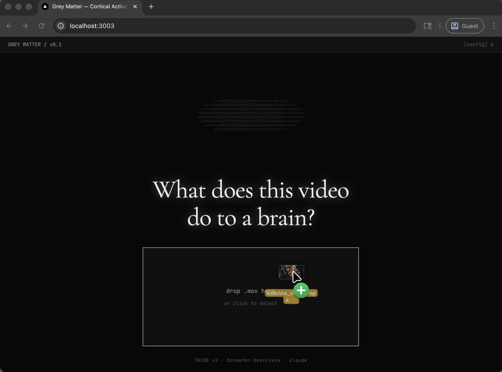
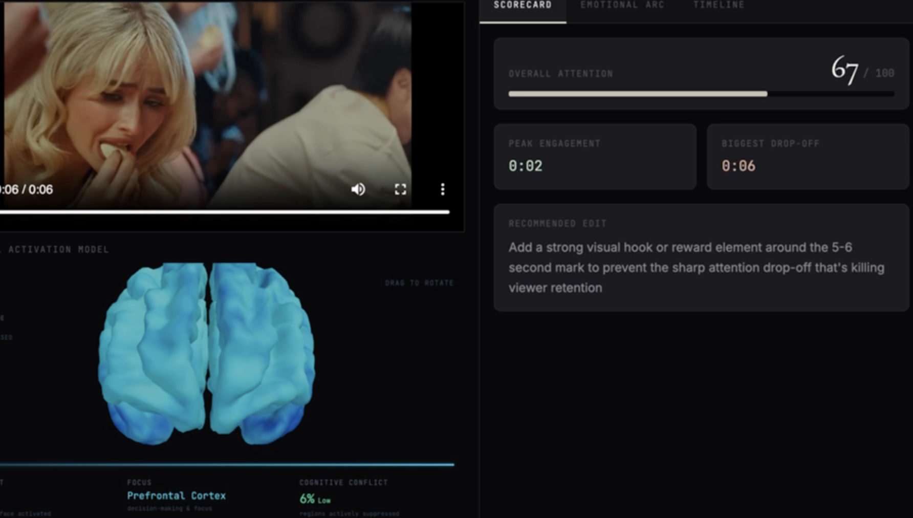
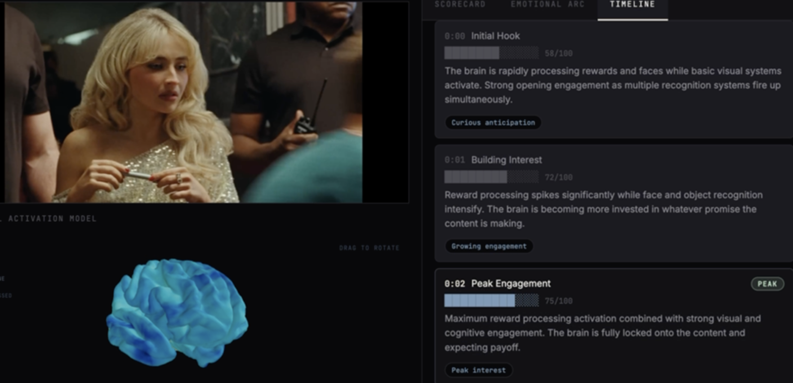

# Grey Matter

Predicting how your brain responds to content — more accurately than actual brain scans.

## Background

Ad metrics like clicks, watch time, and scroll depth tell you *what* happened but never *why* — a viewer can watch an entire ad while their brain checked out at second 12. Meta's [TRIBE V2](https://aidemos.atmeta.com/tribev2) predicts brain activation from video content frame by frame, but outputs dense numerical arrays across 15+ brain regions that require neuroscience expertise to interpret.

> **Note:** TRIBE V2 processing is compute-intensive — a 5-second video takes approximately 20 minutes to run through the model.

## What Grey Matter Does

Grey Matter pipes TRIBE V2 brain activation data through an LLM to produce actionable ad intelligence. The LLM receives TRIBE activation arrays per timestep, a brain region-to-function reference sheet, and a structured prompt — and produces a three-layer report:

**Layer 1 — Scorecard** (for performance marketers)
Overall attention score, peak engagement moment, biggest drop-off, and a recommended edit. Answers: *is this working, and where do I cut?*

**Layer 2 — Emotional Arc** (for creative directors)
A narrative of the emotional journey — where the viewer locks in, where momentum dies, and how much engagement remains when the CTA lands. Answers: *did this make people feel what we intended?*

**Layer 3 — Timestep Timeline** (for content creators)
Second-by-second breakdown with engagement scores, labeled moments (spikes, coasting, drop-offs, recoveries), and plain-language feeling tags at each timestep. Answers: *which exact moment worked, and why?*

## Screenshots

### Upload

### Scorecard

### Timeline

## Tech Stack

- **Language:** TypeScript
- **Framework:** Next.js (React)
- **Styling:** Tailwind CSS
- **AI:** Anthropic Claude API (Claude Sonnet 4), Claude Agent SDK
- **Neuroscience Model:** [Meta TRIBE V2](https://aidemos.atmeta.com/tribev2)
